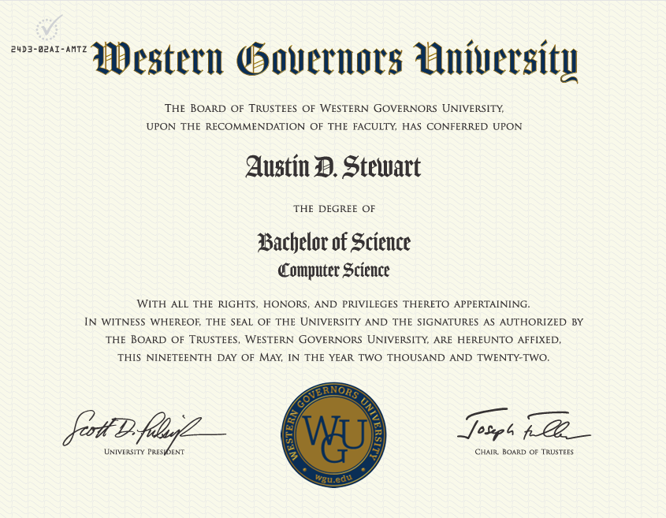
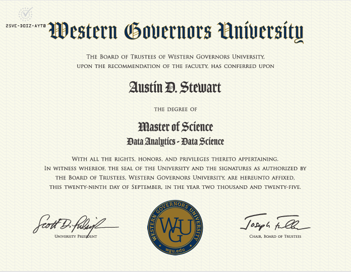

  
  

<h1 align="center">Austin Stewart, MSDS</h1>

  <strong>Health Data Analytics & Automation Engineer</strong> 
  Ranked #1 Worldwide in SQL on HackerRank

  Helena, Montana · Python · SQL · Excel · Tableau · ServiceNow

  
  
  
  
  

## Videos

### SQL Joins
- [Watch Video](https://www.youtube.com/watch?v=AWZ0cLb2ynw)

### CTEs, Views, and SQL (Conceptual Video)
- [Watch Video](https://www.youtube.com/watch?v=XN81FafUJMo)

### Scalar Subqueries
- [Watch Video](https://www.youtube.com/watch?v=0VK_6XhCc6s)

### More Videos
- [Austin Stewart YouTube Channel](https://www.youtube.com/@AustinStewart001/videos)

## Excel

## Statistics and Probability
Test Statistics and P-Values (How they relate to each other):

## Overview

I design systems that remove manual work from healthcare operations.

At the Montana Department of Public Health and Human Services, I have:

- Automated Medicaid repayment processing for 4,000+ individuals using Python and Pandas  
- Migrated over 50 years of historical records into Snowflake with SQL and Python  
- Converted manual government workflows into automated ServiceNow PDF pipelines  
- Built analytics dashboards that surfaced systemic inefficiencies and reduced processing time  

My work centers on operational analytics, automation at scale, and healthcare system modernization.

Here on GitHub, I publish architecture-focused case studies and analytics projects that demonstrate complete workflows

## Focus Areas

- Healthcare Analytics & Government Systems  
- Process Automation at Scale  
- Root-Cause Investigation  
- Data Engineering for Analytics  
- SQL Optimization & Modeling  
- Python Automation Pipelines  
- BI Dashboards & Executive Reporting  

## Flagship Work

### Medical Readmissions Analysis

I analyzed hospital readmission data from 2008 through 2016 to identify trends, seasonal patterns, and periods of accelerated improvement. This project demonstrates data cleaning, SQL analysis, Tableau dashboard development, and data storytelling.

**GitHub Repository:**  
<https://github.com/austinstewartmsda-stack/Medical-Readmissions>

### Medicaid Repayment Automation
Automated repayment pipelines serving more than 4,000 individuals. Replaced manual processing with Pandas-driven workflows that saved thousands of administrative hours annually. This project contains information on a sensitive system and therefore I am not allowed to share the code. 

### 50-Year Data Digitization & Snowflake Migration
Cleaned and migrated five decades of Medicaid records from CSV files and scanned paper archives into a Snowflake warehouse using SQL and Python. This project contains information on a sensitive system and therefore I am not allowed to share the code. 

### ServiceNow PDF Automation Engine
Built enterprise-grade PDF generation workflows that replaced multi-step clerical processes with push-button automation.
This project contains information on a sensitive system and therefore I am not allowed to share the code. 

## Tooling

### Analytics & BI
SQL • Python • Tableau • Excel  

### Automation & Systems
ServiceNow • Power Automate • ETL Pipelines • PDF Automation • Workflow Orchestration  

## Certifications

- CompTIA Project+  
- ITIL Foundation  
- Flow Designer  
- IT Essentials  

## Professional Philosophy

I focus on systems, scale, and outcomes.

When I approach a problem, I look for:

- where data enters the organization  
- where work becomes manual  
- where delays or errors accumulate  
- how automation and analytics can remove friction  

I prefer measurable impact over tooling for its own sake.

## Career Interests

Open to:

- Data Analyst  
- Analytics Engineer  
- BI Engineer  
- Healthcare Analytics Roles  
- Government Technology & Public Sector Analytics  

## Contact

**LinkedIn:** https://www.linkedin.com/in/austin-stewart-msda-6a26741a8  
**GitHub:** https://github.com/austinstewartmsda-stack  
**YouTube:** https://www.youtube.com/@AustinStewart001/videos

---
